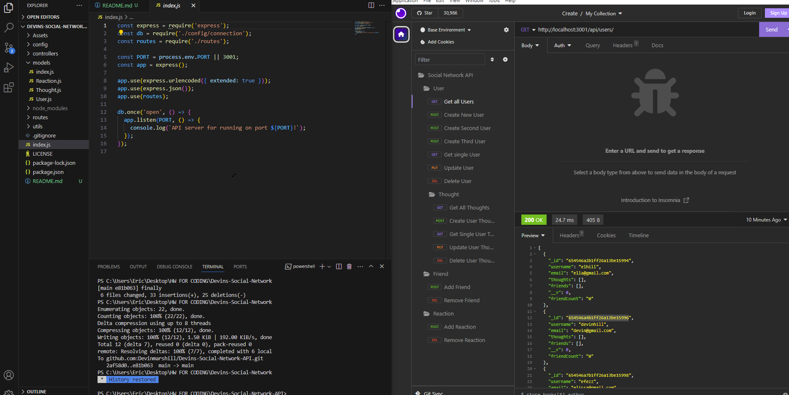

# Devins Social Network API

## Description

The motivation behind this project was to become familiar with Insomnia and testing routing. This project really helped dive into Insomnia using the various get, put, post and delete functions.

## Table of Contents (Optional)

If your README is long, add a table of contents to make it easy for users to find what they need.

- [Installation](#installation)
- [Usage](#usage)
- [Credits](#credits)
- [License](#license)

## Installation

To install my Project, all you have to do is pull the code locally and start the server, it can be replaced to allow for input by users.

## Usage

You will create these files in your javascript MVC Folder Structure, once done, you will open within the integrated terminal so that you have the most up to date file and information. Once done, we can link to Insomnia where we can test our code to make sure it is working correctly. We can go through creating multiple users, thoughts, friends and reactions.

## Credits

TA, Office Hours, Teacher

## License

License: MIT

